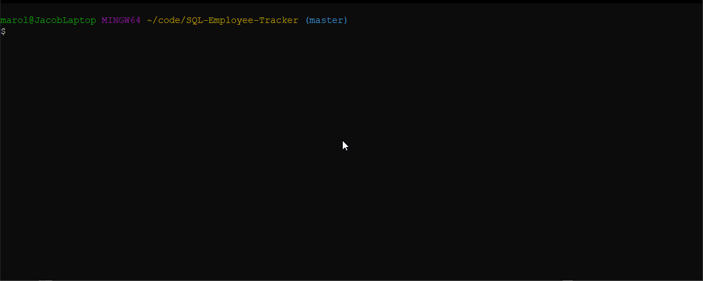

# SQL Employee Tracker

A CLI CMS for managing a company's employees using node and MySQL



## Table of Contents
1. [Installation Instructions](#installation-instructions)
2. [Usage](#usage)
3. [Status](#status)
4. [Questions](#questions)

## Installation Instructions
```
npm install
```

## Usage
```
node app.js
```

## Status


## Questions
If you have any questions, you can ask Mrjcowman at Mrjcowman@gmail.com or through GitHub at [their profile](https://github.com/Mrjcowman)